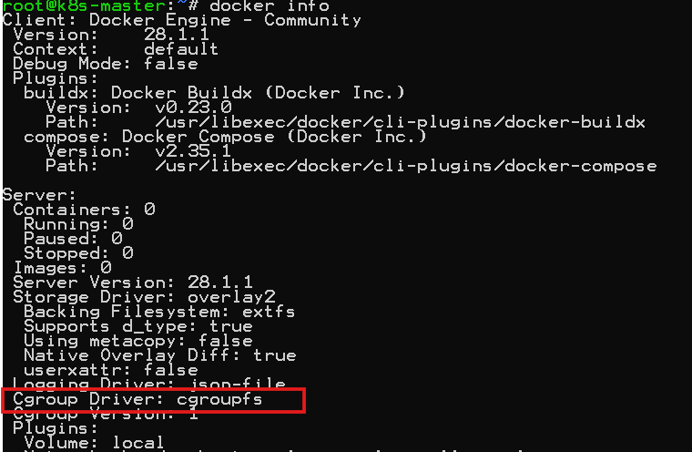
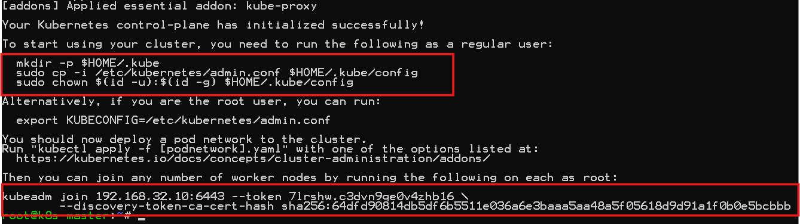
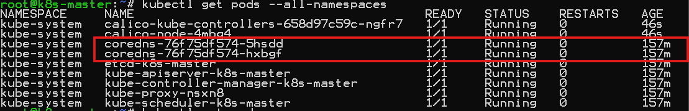
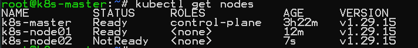

# Kubernetes(k8s)

: 컨테이너화된 워크로드와 서비스를 관리하기 위한 이식성이 있고, 확장가능한 오픈소스 플랫폼이다.

## 1. Virtual Box 설치

- https://www.virtualbox.org/

## 2. Vagrant 설치

```
Vagrant를 사용하지 않고, 직접 VM을 구성하셔도 됩니다. (VirtualBox or VMWare)
Windows의 Docker Desktop은 Cluster 구성이 되지 않기 때문에, 가능하면 VM사용을 권장합니다.
```

- https://www.vagrantup.com/

## 3. 작업 폴더 생성

```
ex) C:\Work\vagrant
```

- Vagrant VM 초기화

```
C:\Work\vagrant>vagrant init
```

- Vagrant VM 실행
  - 제공되는 vagrant 폴더의 Vaganrtfile을 C:\Work\vagrant 폴더로 복사

```
C:\Work\vagrant>vagrant up
```

- Vagrant VM 확인

```
C:\Work\vagrant>vagrant status

        # 192.168.32.10 -> Kubernetes Master (CPU:2, MEM:2048M)
        # 192.168.32.11 -> Kubernetes Node1 (CPU:1, MEM:1024M)
        # 192.168.32.12 -> Kubernetes Node2 (CPU:1, MEM:1024M)
```

- Vagrant VM 실행
  - $ vagrant ssh-config [vm name ex) k8s-node01]

```
C:\Work\vagrant>vagrant ssh [Vagrant VM 이름]
        ex) vagrant ssh k8s-master
```

ssh-config.sh 파일 내용입니다

```sh
#! /usr/bin/env bash

now=$(date +"%m_%d_%Y")
# SSH 날짜별로 백업
cp /etc/ssh/sshd_config /etc/ssh/sshd_config_$now.backup
#비밀번호 로그인 허용
sed -i -e 's/PasswordAuthentication no/PasswordAuthentication yes/g' /etc/ssh/sshd_config
#SSH 서비스 재시작
systemctl restart sshd
```

`sed` 는 파일 내용을 직접 편집(치환·삭제·추가) 하는 스트림 편집기(Stream EDitor)입니다.  
sed -i 's/찾을문자/바꿀문자/옵션' 파일

## 4. 사전 준비 - Master, Node 모두

- Root 계정 변경

```
sudo su -
```

- Root Password 변경 (ex, vagrant로 변경)

```
passwd root
```

- SWAP 비활성화

```
swapoff -a && sed -i '/swap/s/^/#/' /etc/fstab
```

- 노드간 통신을 위한 Bridge 설정 (Iptables 커널 옵션 활성화)

```sh
# 부팅시 자동으로 로드할 커널 모듈 : Linux Bridge 트래픽을 iptables로 넘겨줌
cat <<EOF | sudo tee /etc/modules-load.d/k8s.conf
br_netfilter
EOF

cat <<EOF>>  /etc/sysctl.d/k8s.conf
net.bridge.bridge-nf-call-ip6tables = 1
net.bridge.bridge-nf-call-iptables = 1
net.ipv4.ip_forward = 1
EOF

```

`tee` 파이프(|)를 통해 전달받은 표준 입력(데이터)을 화면(표준 출력)과 하나 이상의 파일에 동시에 출력해주는 유틸리티입니다.

```
sysctl --system
```

`sysctl` 은 시스템에 등록된 모든 sysctl 설정파일을 읽어서 적용합니다. 재부팅 없이 커널에 바로 적용됩니다.

- 커널 모듈 즉시 리로드

```
modprobe br_netfilter
lsmod | grep br_netfilter
ls /proc/sys/net/bridge
```

> `커널 모듈` 필요할 때 커널에 꽂아 쓰는 기능 플러그인입니다.  
> **lsmod** 현재 로드되어 있는 모듈(플러그인) 목록 조회  
> **modinfo** 모듈 상세정보  
> **rmod** 모듈제거  
> **modprobe** 모듈 로드

- Hostname 변경(Vagrantfile에서 변경 됨), Hosts 파일 수정 --> 각 노드의 ipaddress에 맞게 수정, Hostname 변경하지 않으면 kubeadm join 시 오류 발생

```
192.168.32.10 -> $ hostname k8s-master (or $ hostnamectl set-hostname k8s-master)
192.168.32.11 -> $ hostname k8s-node01
192.168.32.12 -> $ hostname k8s-node02
```

```
vi /etc/hosts
192.168.32.10 k8s-master
192.168.32.11 k8s-node01
192.168.32.12 k8s-node02
```

(서버 재실행)

```
reboot -> vargant ssh k8s-master -> su - -> 패스워드 vagrant 입력
```

hosts 변경확인

```
ping -c 3 k8s-master
```

## 5. Docker 설치, 실행 - Master, Node 모두

- 필수 패키지 설치

```
apt-get -y install ca-certificates curl gnupg net-tools
```

- Docker GPG key 추가

```
curl -fsSL https://download.docker.com/linux/ubuntu/gpg | sudo gpg --dearmor -o /usr/share/keyrings/docker-archive-keyring.gpg
```

- Docker repostory 등록

```
echo \
  "deb [arch=$(dpkg --print-architecture) signed-by=/usr/share/keyrings/docker-archive-keyring.gpg] https://download.docker.com/linux/ubuntu \
  $(lsb_release -cs) stable" | sudo tee /etc/apt/sources.list.d/docker.list > /dev/null
```

- Docker engine 설치

```
apt-get update
apt-get install -y docker-ce docker-ce-cli containerd.io
```

- Docker 버전 확인

```
docker version
```

- Docker 서비스 등록

```
systemctl enable docker
systemctl status docker
```

- dockeradmin 유저 생성 (optional)

```
useradd dockeradmin
# password --> dockeradmin
passwd dockeradmin
```

```
usermod -aG docker dockeradmin
```

## 6. Docker compose 설치

```sh
# 다운로드
curl -L "https://github.com/docker/compose/releases/download/1.24.1/docker-compose-$(uname -s)-$(uname -m)" -o /usr/local/bin/docker-compose

# 실행권한 추가
chmod +x /usr/local/bin/docker-compose

# 심볼릭 링크
ln -s /usr/local/bin/docker-compose /usr/bin/docker-compose

# docker-compose 버전확인
docker-compose -version
```

## 7. Kubernetes 설치 - Master, Node 모두

- kubeadm, kubelet, kubectl 설치 및 활성화

```
apt-get install -y apt-transport-https ca-certificates curl gpg
```

- Key 추가 및 apt udpate (24년 이후 설치저장소 변경)

```
mkdir /etc/apt/keyrings

curl -fsSL https://pkgs.k8s.io/core:/stable:/v1.29/deb/Release.key \
| sudo gpg --dearmor -o /etc/apt/keyrings/kubernetes-apt-keyring.gpg

echo "deb [signed-by=/etc/apt/keyrings/kubernetes-apt-keyring.gpg] \
https://pkgs.k8s.io/core:/stable:/v1.29/deb/ /" \
| sudo tee /etc/apt/sources.list.d/kubernetes.list

```

```
apt-get update
```

- 안정화된 최신 버전 설치 (2026-06-07 기준 1.29 버전)

```
apt-get install -y kubelet kubeadm kubectl
```

- 버전 확인

```
kubeadm version
kubelet --version
kubectl version
```

- 최신 버전 업데이트 방지

```
apt-mark hold kubelet kubeadm kubectl
```

- K8s 1.22부터는 systemd와 cgroup을 맞추는 작업 필요  
  도커 설치 정보를 확인하여 Cgroup Driver 가 systemd 인지 확인 해야 합니다.
  `Cgroup(Control Group)` 은 컨테이너가 쓸 수 있는 CPU, 메모리, 프로세스 양을 커널에서 관리하는 기능으로 한마디도 **자원할당관리자**입니다. 컨테이너는 가상서버가 아니므로 한 컨테이너가 자원을 모두 차지하면 호스트 전체가 종료됨. 컨테이너가 쓸 수 있는 자원을 커널 수준에서 통제하는 장치  
  ex) docker run -d --memory=512m --cpus=1 nginx

```
docker info
```



도커의 cgroup 관리를 위해 systemd를 사용하도록 변경

```
sudo mkdir /etc/docker
```

```
cat <<EOF | sudo tee /etc/docker/daemon.json
{
"exec-opts": ["native.cgroupdriver=systemd"],
"log-driver": "json-file",
"log-opts": {
"max-size": "100m"
},
"storage-driver": "overlay2"
}
EOF
```

```
sudo systemctl enable docker
sudo systemctl daemon-reload
sudo systemctl restart docker
```

- containerd 및 kubeadm 최신 업데이트

```sh
# containerd의 사용자 정의 파일을 삭제
rm /etc/containerd/config.toml

# containerd 서비스 재시작
systemctl restart containerd

# kubeadm이 필요로 하는 Kubernetes 핵심 이미지들을 미리 다운로드 (kubeadm init 전에 실행)
kubeadm config images pull
```

## 8. Kubernetes 설정 - Master

- 초기화 (apiserver-advertise-address는 Master ipaddress -> 192.168.32.10)  
  파드들이 사용할 IP 네트워크 대역을 설정

```sh
# Kubernetes 클러스터 설정을 초기화하고, 모든 노드 상태를 초기 상태로 되돌리기
kubeadm reset

#클러스터 생성
kubeadm init --pod-network-cidr=10.96.0.0/16 --apiserver-advertise-address=192.168.32.10
```

> `kubeadm init` : 쿠버네티스 클러스터 생성  
> `--pod-network-cidr` : 파드 네트워크 IP 주소범위  
> `--apiserver-advertise-address` : 수신 대기중임을 알릴 IP 주소로 마스터 노드의 IP

- Kubeadm 실행 후 생성 된 아래 명령어를 복사해 놓고, Worker Node에서 실행 (생성되는 IP, Token 값은 본인의 환경에 따라 다름)
  

```
  mkdir -p $HOME/.kube
  sudo cp -i /etc/kubernetes/admin.conf $HOME/.kube/config
  sudo chown $(id -u):$(id -g) $HOME/.kube/config

kubeadm join 192.168.32.10:6443 --token 7lrshw.c3dvn9qe0v4zhb16 \
        --discovery-token-ca-cert-hash sha256:64dfd90814db5df6b5511e036a6e3baaa5aa48a5f05618d9d91a1f0b0e5bcbbb
```

- kubectl을 root 계정없이 실행 (반드시 실행)

```
mkdir -p $HOME/.kube
sudo cp -i /etc/kubernetes/admin.conf $HOME/.kube/config
sudo chown $(id -u):$(id -g) $HOME/.kube/config
```

- Network add-on - Calico 기본 설치 (Kubernetes Cluster Networking plugin, 2023-06-07 기준 3.25버전)
  파드 간의 통신 혹은 외부와의 통신을 위해서 CNI 플러그인이 필요함.
  `CNI(Container Network Interface)` 플러그인은 서로 다른 노드에 있는 Pod들이 하나의 네트워크에 있는 것처럼 통신하게 해주는 오버레이 네트워크 도구로서 `Flannel`, `Calico`, `Cilium`, `Weave`등이 있습니다.

```sh
# calico CNI 적욕
curl https://docs.projectcalico.org/archive/v3.25/manifests/calico.yaml -O --insecure
kubectl apply -f calico.yaml
```

```sh
# 파드가 실행중인 확인
kubectl get pods --all-namespaces

#
kubectl get nodes
```

  

## 9. Kubernetes 노드 연결 - Node

- 연결 (Master의 init 작업에서 복사 한 커맨드를 사용)

```sh
kubeadm join 192.168.32.10:6443 --token 7lrshw.c3dvn9qe0v4zhb16 \
         --discovery-token-ca-cert-hash sha256:64dfd90814db5df6b5511e036a6e3baaa5aa48a5f05618d9d91a1f0b0e5bcbbb
```

- 연결 시 오류 발생하면 kubeadm reset 명령어로 초기화 후 다시 실행 (Node 모두 초기화)

```
kubeadm reset
```

- 확인 (Master에서)

```
kubectl get nodes
```

  

## 10. 테스트

- Pod 실행

```
kubectl run nginx-test --image=nginx --port 80
```

- Service 실행

```
kubectl expose pod nginx-test
kubectl get services
```

- Service Type 변경

```
kubectl edit service nginx-test # (ClusterIp -> NodePort)
```

- 확인 (port는 service에서 forwarding 된 port 사용)

```
http://192.168.32.10:30039/ # (<- port forwarding)
http://192.168.32.11:30039/ # (<- port forwarding)
```
