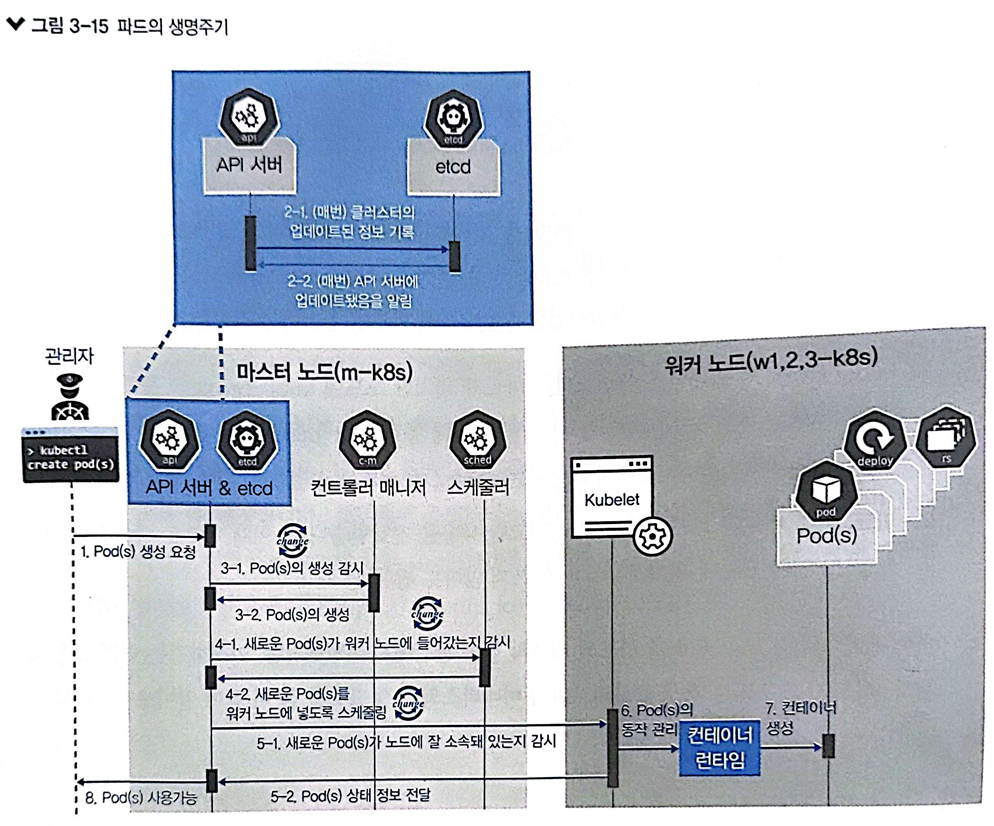

매니페스트(manifest)  
쿠버네티스의 오브젝트를 생성하기 위한 메타 정보를 yaml이나 json으로 기술한 파일을 말합니다.  
yaml이나 json은 데이터 표현양식의 한 종류입니다.

#### 쿠버네티스 구성요소간의 통신

마스터 노드

- `kubectl` : 쿠버네티스 클러스터에 명령을 내리는 역할. 통상적으로 API 서버와 주로 통신하므로 API 서버가 있는 곳에 마스터 노드를 구성
- `API 서버` 쿠버네티스 클러스터의 중심역할을 하는 통로. 주로 상태값을 저장하는 etcd와 통신하지만, 그 밖의 요소들 또한 API 서버를 중심에 두고 통신합니다.
- `etcd(엣시디)` : etc 디렉토리와 distributed 합성어. 구성요소들의 상태 값이 모두 저장되는 곳입니다. etcd의 정보만 백업되어 있다면 긴급한 장애 상화에서도 쿠버네티스 클러스터는 복구할 수 있습니다.
- `스케쥴러` : 노드의 상태와 자원, 레이블, 요구조건등을 고려해 파드를 어떤 워커 노드에 생성할 것인지를 결정하고 할당합니다.

워커노드

- `kubelet` : 파드의 구성 내용(PodSpec)을 받아서 컨테이너 런타임으로 전달하고, 파드 안의 컨테이너들이 정상적으로 작동하는지 모니터링 합니다.
- `컨테이터 런타임(CRI. Container Runtime Interface)` : 파드를 이루는 컨테이너의 실행을 담당합니다. 파드 안에서 다양한 종류의 컨테이너가 문제없이 작동하게 만드는 표준 인터페이스입니다.
- `파드(Pod)` : 한 개 이상의 컨테이너로 단일 목적의 일을 하기 위해서 모인 단위입니다. 즉 웹 서버의 역할을 할 수도 있고 로그나 데이터를 분석할 수도 있습니다. 파드는 언제라도 죽을 수 있는 존재.

선택가능한 구성요소

- `네트워크 플러그인` : 쿠버네티스 클러스터의 통신을 위해서 네트워크 플러그인을 선택하고 구성해야 합니다. 주로 사용하는 CNI에는 **캘리코(Calico)**, 실리움(Cilium), 큐브 라우터(kube-router), 로마나(Romana), 위브넷(WeaveNet), Canal 이 있습니다.

  > CNI(Container Network Interface)는 클라우트 네이티브 컴퓨팅 재단의 프로젝트로 컨테이너의 네트워크 안정성과 확장성을 보장하기 위해 개발. Calicos는 L3로 컨테이너 네트워크를 구성하고, Flannel은 L2로 컨테이너 네트워크를 구성합니다.

- `CoreDNS` : 클라우드 네이티브 컴퓨팅 재단에서 보증하는 프로젝트로, 빠르고 유연한 DNS 서버입니다. 실무에서 쿠버네티스 클러스터를 구성하여 사용할 때는 IP 보다 도메인 네임을 편리하게 관리해주는 CoreDNS 를 사용하는 것이 일반적입니다.

#### 파드의 생명주기



1. **kubectl**을 통해 **API 서버**에 파드 생성 요청
2. 업데이트가 있을 때 마다 API 서버에 전달된 내용이 있으면 API 서버는 **etcd**에 전달된 내용을 모두 기록해 클러스터의 상태 값을 최신으로 유지합니다.
3. API 서버에 생성이 요청된 것을 **컨트롤러 매니저**가 인지하면 컨트롤러 매니저는 **파드**를 생성하고, 이 상태를 API 서버에 전달합니다.
4. API 서버에 파드가 생성됐다는 정보를 **스케줄러**가 인지합니다. 스케줄러는 생성된 파드를 어떤 워커 노드에 적용할지 조건을 고려해 결정하고 해당 **워커 노드**에 파드를 띄우도록 요청합니다.
5. API 서버에 전달된 정보대로 지정한 워커 노드에 파드가 속해 있는지 스케줄러가 kubelet으로 확인합니다.
6. kubelet에서 **컨테이너 런타임**으로 파드 생성을 요청합니다.
7. 파드가 생성됩니다.
8. 파드가 사용 가능한 상태가 됩니다.

#### 파드 생성하고 관리하기

파드는 쿠버네티스의 기본 배포 단위이면서 다수의 컨테이너를 포함합니다.  
사이드카 패턴: 기본기능을 하는 컨테이너와 부가기능을 하는 컨테이너가 결합한 것

```sh
kubectl create deployment my-httpd --image=httpd --replicas=1 --port=80
```

#### 쿠버네티스 명령어

- kubectl get pods --all-namespaces  
  설치된 쿠버네티스 구성요소 확인. 구성요소의 이름은 중복을 피하기 위해 뒤에 해시코드(무작위 문자열)가 삽입됩니다.

- kubectl get deployment
- kubectl get deployment -o wide
- kubectl get pod
- kubectl get pod -o wide <- IP 확인
